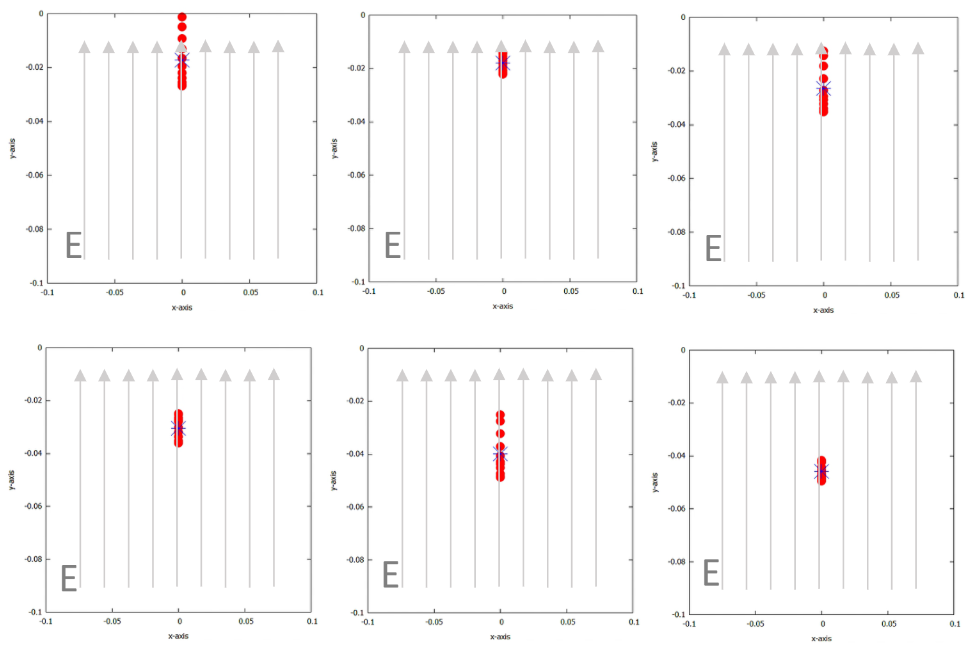

# Slinky Simulation Project

</img>

## Overview
This project simulates the motion of a slinky using a system of masses connected by massless springs. The simulation is implemented in Fortran 90 and utilizes the Euler-Cromer numerical method for accurate integration of the equations of motion. The project explores various aspects of slinky dynamics, including vertical hanging, catenary-like curves, and free-falling scenarios.

## Features
- **Vertical Hanging Slinky**: Investigates equilibrium length, effects of mass and spring constants, and behavior under different gravitational conditions (e.g., on the Moon).
- **Catenary-like Curves**: Compares the shape of a suspended slinky with the true catenary curve and examines the effects of variable masses and spring constants.
- **Free-Falling Slinky**: Studies the motion of a dropped slinky, including the time delay for the bottom mass to start moving and the behavior of the center of mass.
- **Additional Dynamics**: Includes scenarios like oscillating the first mass and simulating a charged slinky in a uniform electric field.

## Requirements
- Fortran 90 compiler (e.g., `gfortran`)
- Gnuplot or similar for data visualization (optional, for plotting results)

## Usage
The program generates output files containing the positions of the masses over time. These files can be used for further analysis and visualization.

## Key Parameters
- N: Number of particles (default: 10).
- k: Spring constant (default: 20 N/m).
- m: Mass of each particle (default: 1 g).
- g: Gravitational acceleration (default: 9.8 m/s²).
- dt: Time step for integration (default: 10⁻⁴ s).

This repository contains code simulations corresponding to key theoretical sections:

- Section **2.1.2**: In the code simulates a catenary-like hanging curve.
- Section **2.3.1**: In the code models the collapse dynamics of a falling Slinky.
- Section **2.3.2**: In the code explores forced oscillations and artificial gravity.

Modify these parameters in the source code to explore different scenarios.

## Examples
1. Vertical Hanging Slinky:
- Fix m0 at the origin and simulate the relaxation of other masses under gravity.
- Plot the equilibrium positions to observe the elongation.

2. Catenary-like Curve:
- Fix m0 at (0, 0) and mN at (1, 0), then simulate the equilibrium shape.
- Compare the shape with a true catenary curve.

3. Free-Falling Slinky:
- Drop the slinky from its equilibrium state and analyze the motion of the center of mass.

## Future Work
- Implement simulations for a freely-dropped suspended slinky.
- Compare the model with real-world slinky behavior.
- Study the effects of different fluids (e.g., water, oil) on slinky dynamics.

## Contributors
- Amal Ali Marzooq
- Raghad Ebrahim Ali Rashid
- Yageen Muneer Kadhem Ahmed
